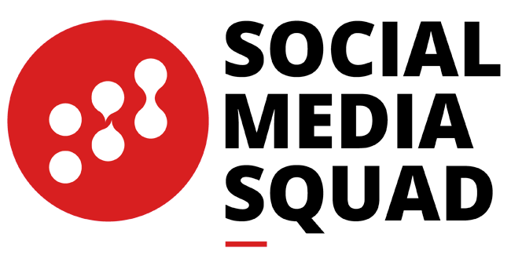

# Case Studies & User Stories 🐒

Stories from people using Loomio to make the world a better place. 1 feature video for each category, followed by a list of all the stories we have.

## Conscious Consumers

<strong><a href="http://consciousconsumers.org.nz/" target="_blank">Conscious Consumers</a></strong> use Loomio for good governance. CEO Ben Gleisner explains the value of keeping all their information in one place, and including people along the way to a decision:

  <iframe src="https://www.youtube.com/embed/lOUm0qpgDAA?list=PLfeqYbxvuD29MfdIvQ7hnzg0LMcK4DEDZ" frameborder="0" allowfullscreen></iframe>

## Other Business & Co-op Stories

  <!-- <h3>Social Media Squad</h3> -->
  

  
The <strong><a href="http://socialmediasquad.cc/" target="_blank">Social Media Squad</a></strong> use Loomio to make important decisions without the time pressure of an in-person meeting. <a href="http://blog.loomio.org/2016/01/14/socialmediasquad/" target="_blank">Find out more...</a>

  <!-- <h3>Urban Adventures</h3> -->
  

  
<strong><a href="http://www.urbanadventures.com/" target="_blank">Urban Adventures</a></strong> are a startup with staff and partners spread across the globe. <a href="http://blog.loomio.org/2014/02/28/organising-adventure-across-six-continents/" target="_blank">In this story</a>, General Manager Tony Carne explains how Loomio has helped them manage conversations across the continents.

  <h3>Your Story Here</h3>
  
  
If you've got a Loomio story you'd like to share, <a href="https://loomio.org/contact" target="_blank">get in touch</a>.

---

* [SolidFund Coop](http://blog.loomio.org/2016/08/15/solidfund/) - get their members to participate in an important thing
* [NEIT](http://blog.loomio.org/2016/08/30/neit/) - unlock great ideas from the introverts
* [Trusty Amigos](http://blog.loomio.org/2016/08/17/trustyamigos/) - bilingual members jamming together
* [Robin Hood Coop](http://blog.loomio.org/2016/01/05/robinhood/)

---

## Statistics New Zealand

<strong>Statistics New Zealand</strong> used Loomio to refine the questions in the 2018 Census with members of the public. In this video, they explain how Loomio allowed them to reach a greater number and diversity of people, compared to traditional citizen engagement methods.

  <iframe width="560" height="315" src="https://www.youtube.com/embed/HBfO62TXZSo?list=PLfeqYbxvuD29MfdIvQ7hnzg0LMcK4DEDZ" frameborder="0" allowfullscreen></iframe>

## Other Government Stories

  <!-- <h3>Land Information New Zealand</h3> -->
  

  
<strong>Land Information New Zealand (LINZ)</strong> used Loomio to engage stakeholders to develop NZ GOAL-SE: a framework for open source licensing of New Zealand Government software. <a href="http://blog.loomio.org/2016/05/11/nzgoal/"  target="_blank">Read the story</a> from Paul Stone, Programme Leader for Open Government Data at LINZ.

  <!-- <h3>National Assembly for Wales</h3> -->
  

  
The <strong><a href="http://www.assembly.wales/" target="_blank">National Assembly for Wales</a></strong> is a Welsh law-making body. <a href="https://blog.loomio.org/2016/05/16/national_assembly_wales/" target="_blank">Read about how they used Loomio</a> to engage a diverse audience in a mutli-stakeholder engagement project.

  <!-- <h3>Wellington City Council</h3> -->
  

  
In 2013, <strong><a href="http://wellington.govt.nz/" target="_blank">Wellington City Council</a></strong> contracted Loomio to run the online side of their largest public consultation exercise of the year – developing an alcohol management strategy for the city. <a href="https://blog.loomio.org/2013/11/01/wellington-city-council-uses-loomio/" target="_blank">Read more...</a>
  

---

## NGO/NFP/Trust

* [Equally Well](http://blog.loomio.org/2015/06/05/turning-a-conference-into-a-movement-with-loomio/) - turned a conference into a meeting
* [Pathways](http://blog.loomio.org/2014/04/07/jacqui-graham-meaningful-engagement-in-a-large-organisation/) - create strong small teams within their organisation
* [Newtown Ethical Lending Trust](http://blog.loomio.org/2013/10/18/trustees-trust-loomio/) - approve loan applications without having a meeting

## Collectives

* Kava Club feature video coming soon
* [Guerilla Translators](http://blog.loomio.org/2016/05/13/guerrilla-translation/)
* [Gängeviertel Collective](http://blog.loomio.org/2016/02/22/gaengeviertel/)
* [P2P Foundation](http://blog.loomio.org/2016/02/15/p2p/)
* [Red Victorian coliving](http://blog.loomio.org/2016/02/04/redvic/)
* [Ouishare Network](http://blog.loomio.org/2016/01/21/ouishare/)
* [17 Tory St arts collective](http://blog.loomio.org/2015/10/21/how-to-run-an-open-source-community-space/)

## Political

* [Debt Resistance UK](http://blog.loomio.org/2016/03/07/druk/)
* [COY11 Global Youth Coalition](http://blog.loomio.org/2015/12/23/coy11/)
* [Gen Zero](http://blog.loomio.org/2013/11/19/nation-changing-decision-makers-generation-zero/)